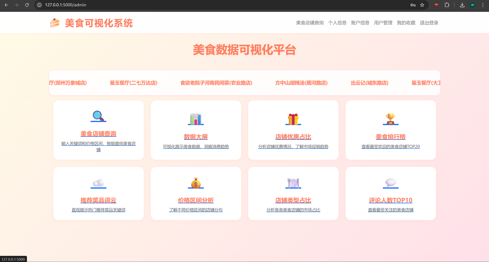
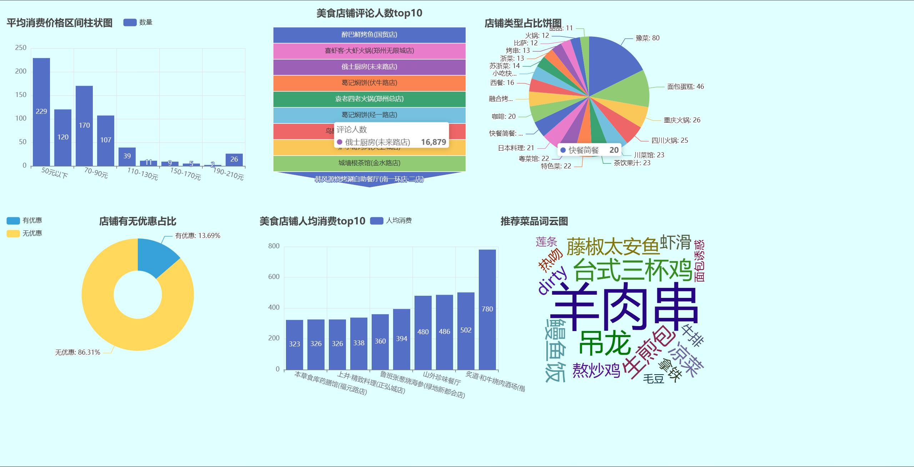
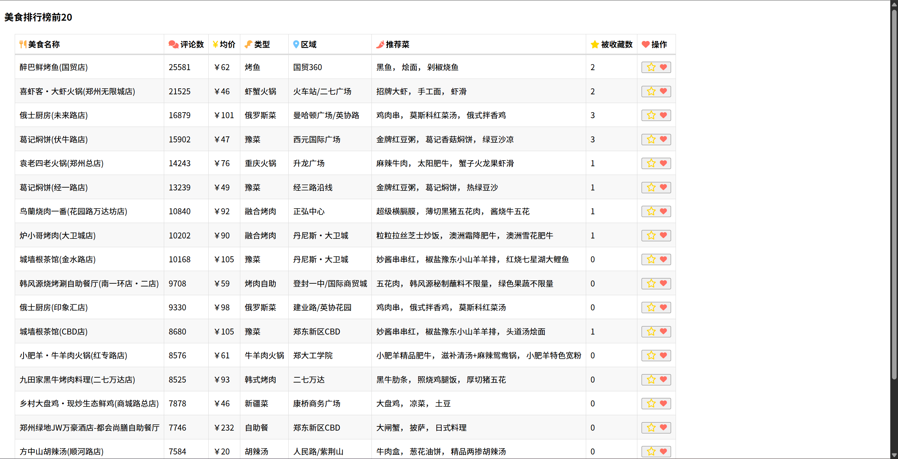
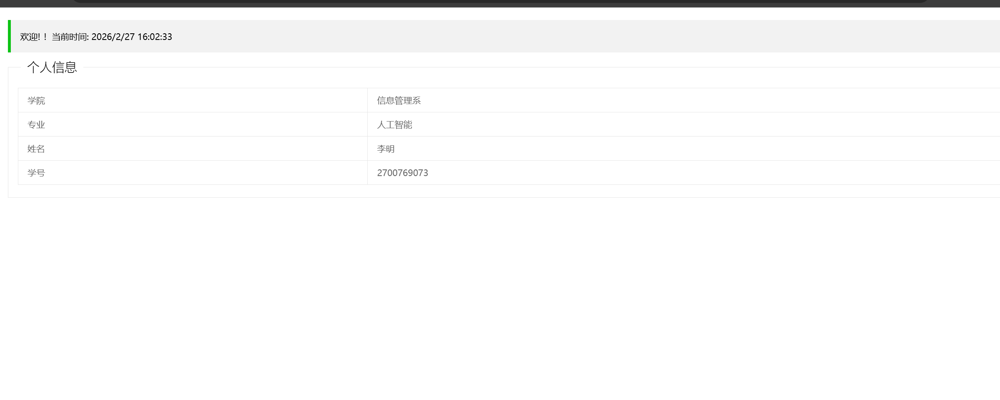

# 美食数据采集与可视化系统

本项目是一个基于 Python 的美食店铺数据爬取、存储与可视化分析平台。系统通过爬虫采集美食数据，清洗后存入数据库，并通过 Web 前端及 ECharts 图表实现了多维度的数据可视化展示（包括店铺排行、消费区间、店铺类型占比等）。

## 📸 系统界面展示

### 1. 系统主页
展示系统的整体导航与概览信息。


### 2. 数据大屏展示
多维度的美食数据图表可视化（涵盖词云、柱状图、饼图等）。


### 3. 美食排行榜
展示按评分、评论数或人均消费排序的 Top 级美食店铺。


### 4. 店铺及数据查询
支持按条件检索特定的美食店铺数据。


### 5. 店铺详情页
展示单个商家的详细信息、评分及用户评论分布。


### 6. 个人中心
用户个人信息管理与系统设置。


## 🚀 快速启动

1. **安装依赖**
   在项目根目录下运行以下命令安装所需 Python 包：
   ```bash
   pip install -r requirements.txt

2. **数据库导入**
   将 data/food.sql 导入到你的 MySQL 数据库中，并修改对应的数据库连接配置。

3. **运行项目**
  启动入口文件： python visual/app.py
  随后在浏览器中访问控制台输出的本地地址即可。